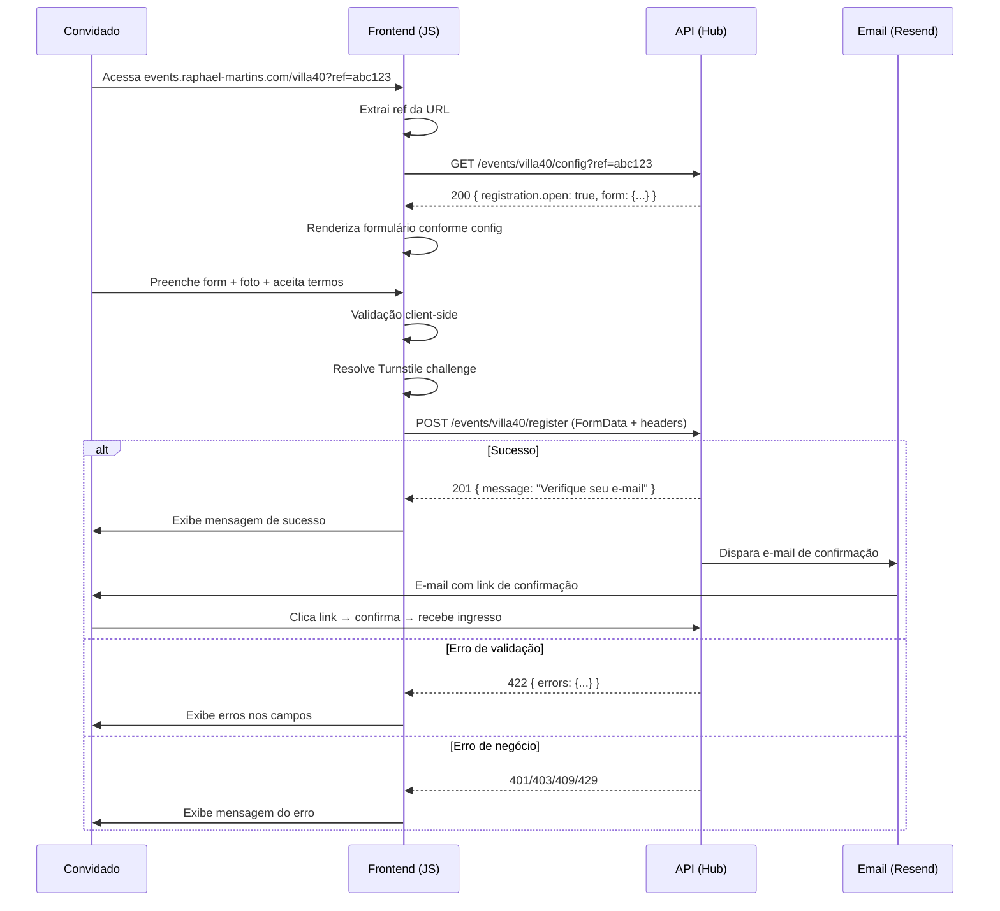

# API Contract — Events Frontend ↔ RaphaelPersonalHUB

> **Consolidado no MVP:** escopo v1, stack alinhada ao Hub e notas de evolução estão em **[SPEC.md](SPEC.md)**. Este arquivo mantém o detalhe linha-a-linha do contrato HTTP e o diagrama de sequência.

---

> Contrato de comunicação entre o frontend estático em `events.raphael-martins.com` e a API em `api.raphael-martins.com`.

**Versão:** 1.0 (draft)
**Base URL:** `https://api.raphael-martins.com/api/v1`
**Content-Type padrão:** `application/json` (exceto upload de arquivos)

---

## Convenções Gerais

### Headers Comuns

| Header | Obrigatório | Descrição |
|--------|-------------|-----------|
| `Accept` | Sim | `application/json` |
| `X-Ref-Token` | Condicional | Token de referral do promoter. Obrigatório em eventos com lista controlada. |
| `X-Turnstile-Token` | Condicional | Token Cloudflare Turnstile. Obrigatório em submissões de formulário. |

### Estrutura de Resposta Padrão

Todas as respostas seguem o envelope:

```json
{
  "success": true,
  "message": "Mensagem legível para o usuário",
  "data": { ... }
}
```

Em caso de erro:

```json
{
  "success": false,
  "message": "Mensagem legível para o usuário",
  "errors": {
    "campo": ["Detalhe do erro"]
  }
}
```

> [!NOTE]
> `errors` só está presente em validação (`422`). Nos demais erros, apenas `message`.

### Códigos HTTP Utilizados

| Código | Uso |
|--------|-----|
| `200` | Sucesso em GET |
| `201` | Recurso criado (registro de convidado) |
| `401` | Token de referral inválido, expirado ou revogado |
| `403` | Ação não permitida (inscrições fechadas, evento não publicado) |
| `404` | Evento não encontrado |
| `409` | Conflito (email duplicado, evento lotado) |
| `422` | Erro de validação nos campos do formulário |
| `429` | Rate limit excedido |
| `500` | Erro interno do servidor |

### CORS

A API deve permitir requests de `events.raphael-martins.com`:

```
Access-Control-Allow-Origin: https://events.raphael-martins.com
Access-Control-Allow-Headers: Accept, Content-Type, X-Ref-Token, X-Turnstile-Token
Access-Control-Allow-Methods: GET, POST, OPTIONS
```

---

## Endpoints

---

### 1. Configuração do Evento

```
GET /events/{slug}/config
```

Retorna tudo que o frontend precisa para renderizar o formulário e controlar a experiência do convidado. É a primeira chamada que o JS faz ao carregar a página.

#### Query Parameters

| Param | Tipo | Obrigatório | Descrição |
|-------|------|-------------|-----------|
| `ref` | `string` | Não | Token de referral do promoter |

#### Response `200` — Evento público ou ref válido

```json
{
  "success": true,
  "data": {
    "event": {
      "slug": "villa40",
      "title": "Villa Jr. Faz 40",
      "status": "published",
      "startsAt": "2026-06-06T13:00:00-03:00",
      "endsAt": "2026-06-06T23:00:00-03:00"
    },
    "registration": {
      "open": true,
      "closedMessage": null,
      "spotsLeft": null,
      "totalCapacity": null,
      "requiresRef": true,
      "requiresTurnstile": true
    },
    "form": {
      "fields": [
        {
          "name": "name",
          "type": "text",
          "label": "Nome completo",
          "placeholder": "Seu nome",
          "required": true,
          "enabled": true,
          "maxLength": 255
        },
        {
          "name": "email",
          "type": "email",
          "label": "E-mail",
          "placeholder": "seu@email.com",
          "required": true,
          "enabled": true,
          "maxLength": 255
        },
        {
          "name": "phone",
          "type": "tel",
          "label": "WhatsApp",
          "placeholder": "(00) 00000-0000",
          "required": false,
          "enabled": true,
          "mask": "(00) 00000-0000"
        },
        {
          "name": "photo",
          "type": "file",
          "label": "Sua melhor foto",
          "required": true,
          "enabled": true,
          "accept": "image/jpeg,image/png,image/webp",
          "maxSizeBytes": 5242880,
          "hint": "Foto de rosto, máx. 5MB"
        },
        {
          "name": "birth_year",
          "type": "number",
          "label": "Ano de nascimento",
          "required": false,
          "enabled": false,
          "min": 1940,
          "max": 2010
        }
      ],
      "termsUrl": "https://events.raphael-martins.com/termos",
      "privacyUrl": "https://events.raphael-martins.com/privacidade",
      "submitLabel": "Confirmar presença"
    },
    "payment": {
      "required": false,
      "amount": null,
      "currency": "BRL"
    },
    "ref": {
      "valid": true,
      "name": "Lista do João",
      "expiresAt": "2026-06-05T23:59:59-03:00"
    }
  }
}
```

#### Response `200` — Sem ref em evento que exige ref

```json
{
  "success": true,
  "data": {
    "event": {
      "slug": "villa40",
      "title": "Villa Jr. Faz 40",
      "status": "published",
      "startsAt": "2026-06-06T13:00:00-03:00",
      "endsAt": "2026-06-06T23:00:00-03:00"
    },
    "registration": {
      "open": false,
      "closedMessage": "Este é um evento privado. Solicite um link de convite ao organizador.",
      "spotsLeft": null,
      "totalCapacity": null,
      "requiresRef": true,
      "requiresTurnstile": true
    },
    "form": null,
    "ref": {
      "valid": false,
      "name": null,
      "expiresAt": null
    }
  }
}
```

> [!NOTE]
> Quando `registration.open` é `false`, o campo `form` retorna `null`. O frontend não deve renderizar o formulário.

#### Response `200` — Inscrições encerradas (manual ou por capacidade)

```json
{
  "success": true,
  "data": {
    "event": { "..." : "..." },
    "registration": {
      "open": false,
      "closedMessage": "As inscrições para este evento foram encerradas.",
      "spotsLeft": 0,
      "totalCapacity": 150,
      "requiresRef": true,
      "requiresTurnstile": true
    },
    "form": null,
    "ref": { "valid": true, "name": "Lista do João", "expiresAt": "..." }
  }
}
```

#### Response `200` — Evento encerrado (pós data)

```json
{
  "success": true,
  "data": {
    "event": {
      "slug": "villa40",
      "title": "Villa Jr. Faz 40",
      "status": "ended",
      "startsAt": "2026-06-06T13:00:00-03:00",
      "endsAt": "2026-06-06T23:00:00-03:00"
    },
    "registration": {
      "open": false,
      "closedMessage": "Este evento já aconteceu! Confira as fotos no álbum.",
      "spotsLeft": null,
      "totalCapacity": null,
      "requiresRef": false,
      "requiresTurnstile": false
    },
    "form": null,
    "ref": null,
    "album": {
      "available": true,
      "totalPhotos": 47
    }
  }
}
```

#### Response `404` — Evento não encontrado

```json
{
  "success": false,
  "message": "Evento não encontrado."
}
```

---

### 2. Registro de Convidado

```
POST /events/{slug}/register
Content-Type: multipart/form-data
```

Submete o formulário de cadastro do convidado. Usa `multipart/form-data` por causa do upload de foto.

#### Headers

| Header | Obrigatório | Descrição |
|--------|-------------|-----------|
| `X-Ref-Token` | Condicional | Token do promoter (obrigatório se evento exige ref) |
| `X-Turnstile-Token` | Sim | Token do Cloudflare Turnstile |

#### Body (FormData)

| Campo | Tipo | Obrigatório | Descrição |
|-------|------|-------------|-----------|
| `name` | `string` | Sim | Nome completo |
| `email` | `string` | Sim | E-mail válido |
| `phone` | `string` | Condicional | WhatsApp com DDD. Obrigatoriedade definida pelo config. |
| `photo` | `File` | Condicional | Imagem JPG/PNG/WebP, máx 5MB. Obrigatoriedade definida pelo config. |
| `birth_year` | `number` | Condicional | Ano de nascimento (4 dígitos) |
| `consent_terms` | `boolean` | Sim | Aceite dos termos de uso e privacidade |

#### Response `201` — Sucesso (fluxo gratuito — confirmação por e-mail)

```json
{
  "success": true,
  "flow": "email_confirmation",
  "message": "Recebemos sua inscrição! Enviamos um e-mail para seu@email.com com um link para confirmar seu interesse e receber o ingresso. Verifique caixa de entrada e spam."
}
```

#### Response `201` — Sucesso (fluxo pago — Checkout Pro)

```json
{
  "success": true,
  "flow": "checkout",
  "checkoutUrl": "https://www.mercadopago.com.br/checkout/v1/redirect?pref_id=...",
  "message": "Redirecionando para o pagamento..."
}
```

> [!NOTE]
> O frontend deve redirecionar para `checkoutUrl` quando `flow === "checkout"`. Após o pagamento, o Mercado Pago redireciona para `GET /events/payment/return/{token}` no Hub (polling). O ingresso é enviado por e-mail após aprovação (webhook).

> [!NOTE]
> O frontend não recebe `guestId` na API pública. No fluxo gratuito, a confirmação de interesse é por e-mail (`GET /events/guest/confirm/{token}`).

#### Response `422` — Erro de validação

```json
{
  "success": false,
  "message": "Verifique os campos e tente novamente.",
  "errors": {
    "name": ["O nome é obrigatório."],
    "email": ["Informe um e-mail válido."],
    "photo": ["A foto deve ter no máximo 5MB.", "Formato aceito: JPG, PNG ou WebP."],
    "consent_terms": ["Você precisa aceitar os termos para continuar."]
  }
}
```

#### Response `401` — Ref token inválido

```json
{
  "success": false,
  "message": "Seu link de convite é inválido ou expirou. Solicite um novo ao organizador."
}
```

#### Response `403` — Inscrições fechadas

```json
{
  "success": false,
  "message": "As inscrições para este evento estão encerradas."
}
```

#### Response `409` — Conflito

E-mail duplicado:
```json
{
  "success": false,
  "message": "Este e-mail já está cadastrado neste evento. Caso não tenha recebido seu ingresso, entre em contato com o organizador."
}
```

Evento lotado:
```json
{
  "success": false,
  "message": "Infelizmente todas as vagas foram preenchidas."
}
```

#### Response `429` — Rate limit

```json
{
  "success": false,
  "message": "Muitas tentativas. Aguarde alguns minutos e tente novamente."
}
```

---

### 3. Álbum de Fotos *(futuro)*

```
GET /events/{slug}/album
```

Retorna fotos aprovadas do evento, paginadas.

#### Query Parameters

| Param | Tipo | Default | Descrição |
|-------|------|---------|-----------|
| `page` | `number` | `1` | Página atual |
| `per_page` | `number` | `20` | Itens por página (máx. 50) |

#### Response `200`

```json
{
  "success": true,
  "data": {
    "photos": [
      {
        "id": "uuid",
        "url": "https://cdn.raphael-martins.com/events/albums/villa40/photo-001.webp",
        "thumbnailUrl": "https://cdn.raphael-martins.com/events/albums-thumbs/villa40/photo-001.webp",
        "takenAt": "2026-06-06T15:30:00-03:00",
        "publishedAt": "2026-06-06T16:00:00-03:00"
      }
    ],
    "pagination": {
      "currentPage": 1,
      "lastPage": 3,
      "perPage": 20,
      "total": 47
    }
  }
}
```

#### Response `403` — Álbum não disponível

```json
{
  "success": false,
  "message": "O álbum deste evento ainda não está disponível."
}
```

---

## Rate Limiting

| Endpoint | Limite | Janela | Escopo |
|----------|--------|--------|--------|
| `GET /config` | 30 req | 1 min | IP |
| `POST /register` | 5 req | 5 min | IP + ref token |
| `GET /album` | 60 req | 1 min | IP |

> [!WARNING]
> O Turnstile é a primeira barreira contra bots no `POST /register`. O rate limit por IP + token é a segunda. A validação server-side é a terceira. As três camadas são necessárias.

---

## Fluxo Completo do Frontend



---

## Observações e Decisões Pendentes

> [!IMPORTANT]
> **Turnstile**: Precisa decidir se o site key do Turnstile vem hardcoded no HTML de cada evento ou se vem no response do `GET /config`. Sugestão: hardcoded no HTML (é público mesmo) e o token validado server-side no `POST /register`.

> [!NOTE]
> **Upload de foto**: O tamanho máximo de 5MB é validado tanto no frontend (antes do submit) quanto na API. A API converte para WebP e redimensiona server-side.

> [!NOTE]
> **Campos customizados (futuro)**: O schema de `form.fields` já suporta campos dinâmicos. Campos com `type: "select"` teriam um array `options` adicional. Campos com `type: "checkbox"` para opções binárias além do consent.

> [!NOTE]
> **Versionamento**: Usar `/api/v1/` desde o início permite evolução sem quebrar clientes existentes. Quando a v2 existir, landing pages antigas continuam funcionando.

---

*Documento vivo — atualizar conforme evolução do desenvolvimento.*
