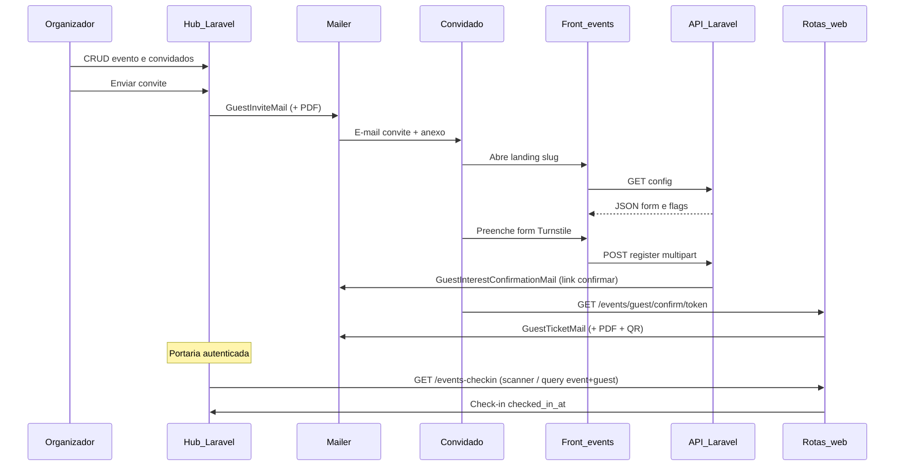

# SPEC — Feature: Eventos privados (MVP v1)

**Projeto:** raphael-hub (Raphael Personal HUB)  
**Stack alinhada ao monólito:** Laravel 13 · PHP 8.4 · PostgreSQL 17 · Redis 7 · Horizon · MinIO S3 (bucket padrão do Hub, típico `pessoal`) · Evolution API (integrações futuras)  
**Última revisão:** 2026-05-10  
**Status:** documento de produto + contrato para **implementação v1**; visão longa prazo permanece no [BRIEFING.md](BRIEFING.md) histórico. Inclui fluxo **confirmação de e-mail → ingresso PDF + QR**, **portaria com leitor** e dependências alinhadas ao código atual.

**Índice:** esta SPEC é a **fonte única de verdade** para o MVP inicial de Eventos no Hub. O briefing original e o [API_Contract.md](API_Contract.md) são mantidos como referência estendida; mudanças operacionais devem atualizar **este arquivo** e, quando houver schema/código, [SPEC.md](../../SPEC.md) e [CHANGELOG.md](../../CHANGELOG.md).

---

## 1. Domínios e URLs canônicas

| Ambiente | URL |
|----------|-----|
| API (Laravel, este repositório) | `https://api.raphael-martins.com` |
| Base da API pública de eventos | `https://api.raphael-martins.com/api/v1` |
| Frontend estático (HTML/CSS/JS) | `https://events.raphael-martins.com` |
| Desenvolvimento local (exemplo) | `http://events.test` / túnel conforme `.env` |

**Nota:** usar sempre **`events`** (com “s”) no subdomínio, alinhado ao contrato HTTP e ao DNS pretendido.

---

## 2. Visão resumida

Eventos privados com lista controlada: o organizador configura o evento no **hub autenticado** (`/hub/events`), mantém **convidados** e dispara **convites por e-mail** com **ingresso em PDF** (template versionado + QR). Convidados podem se inscrever pela **landing estática** (`EVENTS_FRONTEND_URL/{slug}`) via **API** (`GET …/config`, `POST …/register`).

**Inscrição pela landing (fluxo atual):** o `POST /register` cria convidado em `pending_email`, envia **`GuestInterestConfirmationMail`** com link **`GET /events/guest/confirm/{token}`**. Ao confirmar (e-mail válido + vagas), status passa a `confirmed` e é enfileirado **`GuestTicketMail`** com **PDF anexo** (DomPDF) e corpo HTML/Markdown conforme template; o QR codifica a URL de check-in (`…/events-checkin?event=&guest=`).

**Convite pelo organizador:** **`GuestInviteMail`** usa a mesma resolução de template + PDF anexo.

**Portaria:** página dedicada **`GET /events-checkin`** (autenticada + e-mail verificado), layout **sem shell do hub**, mobile-first, **leitor de QR na câmera** (`html5-qrcode` via Vite) e confirmação manual de entrada (`checked_in_at`). Manifest PWA em `public/manifest-events-checkin.json` para instalar como atalho “gadget”; **check-in offline-first** permanece **v2** — ver secção 5.

A visão completa de portfólio (IA no flyer, WhatsApp, álbum colaborativo avançado, JWT de ingresso, etc.) permanece como **evolução (v2)** — ver secção 5.

---

## 3. Escopo v1 (MVP inicial)

Implementar no **mesmo app Laravel** do Hub (não criar projeto separado). Banco **PostgreSQL** (não MySQL).

### 3.1 Hub autenticado (`/hub/events`)

- Novo módulo no painel: entrada em [config/hub_dashboard.php](../../config/hub_dashboard.php), menu em [resources/views/layouts/navigation.blade.php](../../resources/views/layouts/navigation.blade.php), ícone em [resources/views/components/hub/dashboard-icon.blade.php](../../resources/views/components/hub/dashboard-icon.blade.php) (seguir o padrão dos outros hubs).
- **Evento:** CRUD / configuração básica (slug, título, datas, status de publicação, capacidade opcional, flags de formulário público como `requiresRef`, `requiresTurnstile`, schema ou presets dos campos do form alinhados ao contrato `config`).
- **Convidados:** listagem, **criar**, **editar**, **excluir** manualmente (fluxo organizador).
- **Enviar convite:** ação por convidado (ou em lote numa fase posterior) que enfileira envio de e-mail usando o template (secção 7).

Autenticação do organizador no v1: **usuários existentes do Hub** (Laravel Breeze), sem obrigatoriedade de OAuth Google ou Magic Link — isso fica como decisão v2 se necessário.

### 3.2 API pública (`/api/v1/events/...`)

Conforme secção 6 (contrato incorporado):

- `GET /api/v1/events/{slug}/config`
- `POST /api/v1/events/{slug}/register` (`multipart/form-data`)

Requisitos transversais: envelope JSON de sucesso/erro, **CORS** para origem `https://events.raphael-martins.com`, rate limiting conforme tabela na secção 6, validação server-side de **Turnstile** no POST quando `requiresTurnstile` for verdadeiro para o evento.

### 3.3 Convites e ingresso por e-mail

Templates **versionados no repositório**. Implementação atual:

| Peça | Convenção |
|------|-----------|
| E-mail Markdown (fallback) | `resources/views/mail/events/invite-default.blade.php` → view `mail.events.invite-default` |
| E-mail HTML custom por evento | Se existir `resources/views/mail/events/custom/{invite_template_key}.blade.php`, o corpo é **HTML completo** (`Content::htmlString`), com dados `guest`, `checkInUrl`, `qrDataUri` (QR em **SVG** embutido em data URI — evita exigir extensão **imagick** no PHP). |
| PDF do ingresso | `App\Services\Events\EventTicketPdfService` + **DomPDF** (`barryvdh/laravel-dompdf`). Views: `resources/views/pdf/events/invite-default.blade.php`; override `pdf/events/custom/{invite_template_key}.blade.php` quando existir. |
| QR Code (payload) | URL absoluta de check-in gerada por `EventCheckInUrlGenerator` (base `APP_URL` + rota nomeada `events.checkin.show` + query `event` / `guest`). Geração de imagem: `simplesoftwareio/simple-qrcode` com **formato SVG** no serviço `EventQrCodeService` (PNG no pacote exige Imagick). |

Mailables principais: **`GuestInviteMail`**, **`GuestInterestConfirmationMail`** (Markdown `mail.events.guest-interest-confirmation`), **`GuestTicketMail`**. Fila típica: `notifications`.

### 3.4 Rotas web no app Laravel (além da API)

| Rota | Auth | Descrição |
|------|------|-----------|
| `GET /events/guest/confirm/{token}` | Público (throttle) | Confirma interesse após `POST /register`; transição `pending_email` → `confirmed` (respeitando capacidade com lock); enfileira `GuestTicketMail`. |
| `GET /events-checkin` | `auth`, `verified` | Livewire `EventCheckInPage`; layout `layouts.events-checkin` (tela cheia, scanner opcional). |

Não faz parte do contrato JSON consumido pela landing estática; documentado aqui para operação e segurança (portaria logada).

### 3.5 LGPD e termos

| Responsabilidade | Onde |
|------------------|------|
| Texto jurídico estável (termos, privacidade) | Páginas **estáticas** no front `events.raphael-martins.com` (ex.: `/termos`, `/privacidade`), **compartilhadas por todos os eventos**. URLs absolutas expostas em `form.termsUrl` e `form.privacyUrl` no `GET …/config`. |
| Registro de aceite do titular | Campo obrigatório `consent_terms` no `POST …/register`, validado na API. |

O hub não substitui assessoria jurídica; o briefing [BRIEFING.md](BRIEFING.md) §10 permanece como guia de conteúdo.

### 3.6 Front-end assets (portaria)

- **`html5-qrcode`** (npm): leitor na câmera; carregamento lazy via `resources/js/events-checkin.js` importado dinamicamente em `resources/js/app.js` quando existe `#events-checkin-root`.
- Build: `npm install && npm run build` (ou `npm run dev`) para gerar o chunk Vite.

---

## 4. Fluxos v1 (diagrama)



---

## 5. Escopo v2 (evolução — fora do estado atual)

Itens derivados do [BRIEFING.md](BRIEFING.md) que **ainda não** estão cobertos pelo código atual ou são melhorias incrementais:

- **WhatsApp:** pareamento `/vincular EVT-XXXX`, bot 1:1 (recuperação de ingresso), captura de mídia em grupo, comandos `/info`, `/album`, moderação.
- **Ingresso “rico” adicional:** JWT assinado no QR, anti-fraude avançado, revogação de ingresso — hoje o QR é URL com `event` + `guest` (portaria autenticada valida no banco).
- **PWA de check-in offline-first**, sincronização e conflitos — hoje há manifest standalone e leitor online apenas.
- **IA:** extração de dados/paleta do flyer, sugestão de tema da landing.
- **Endpoint público** `GET /api/v1/events/{slug}/album` e integração com **Media Albums** ([SPEC_media_albums.md](../album/SPEC_media_albums.md)) via `album_id` ou projeção de fotos — o contrato HTTP já esboça resposta; implementação **após** MVP núcleo.
- **Promoters:** gestão completa de `referral_links`, métricas em tempo real — pode ser v1.1 se necessário para lista controlada; o contrato já prevê `ref` e `X-Ref-Token`.
- **OAuth Google / Magic Link** para organizador, se divergir do Breeze atual.
- **Resend** ou outro provedor transacional dedicado, webhooks de bounce — hoje o Hub usa Laravel Mail (`MAIL_*`).

---

## 6. Contrato HTTP (API pública, incorporado)

**Versão contrato:** 1.0 (draft), alinhada ao arquivo histórico [API_Contract.md](API_Contract.md).

**Base URL:** `https://api.raphael-martins.com/api/v1`  
**Content-Type padrão:** `application/json` (exceto `POST /register`: `multipart/form-data`)

### 6.1 Headers comuns

| Header | Obrigatório | Descrição |
|--------|-------------|-----------|
| `Accept` | Sim | `application/json` |
| `X-Ref-Token` | Condicional | Token de referral do promoter (lista controlada). |
| `X-Turnstile-Token` | Condicional | Cloudflare Turnstile — obrigatório em `POST /register` quando o evento exigir. |

### 6.2 Envelope de resposta

Sucesso:

```json
{
  "success": true,
  "message": "Mensagem legível para o usuário",
  "data": { }
}
```

Erro:

```json
{
  "success": false,
  "message": "Mensagem legível para o usuário",
  "errors": {
    "campo": ["Detalhe do erro"]
  }
}
```

`errors` aparece tipicamente em `422`; nos demais erros costuma existir apenas `message`.

### 6.3 Códigos HTTP

| Código | Uso |
|--------|-----|
| `200` | Sucesso em GET |
| `201` | Recurso criado (registro de convidado) |
| `401` | Token de referral inválido, expirado ou revogado |
| `403` | Ação não permitida (inscrições fechadas, evento não publicado) |
| `404` | Evento não encontrado |
| `409` | Conflito (e-mail duplicado, evento lotado) |
| `422` | Validação |
| `429` | Rate limit |
| `500` | Erro interno |

### 6.4 CORS

A API deve permitir requests de `https://events.raphael-martins.com`:

```
Access-Control-Allow-Origin: https://events.raphael-martins.com
Access-Control-Allow-Headers: Accept, Content-Type, X-Ref-Token, X-Turnstile-Token
Access-Control-Allow-Methods: GET, POST, OPTIONS
```

### 6.5 `GET /events/{slug}/config`

**Query:** `ref` (opcional) — token do promoter.

Semântica e exemplos JSON completos: ver [API_Contract.md](API_Contract.md) §1 (evento publicado, ref obrigatória ausente, inscrições encerradas, evento encerrado com bloco `album` opcional).

**404:**

```json
{
  "success": false,
  "message": "Evento não encontrado."
}
```

### 6.6 `POST /events/{slug}/register`

**Content-Type:** `multipart/form-data`

**Headers:** `X-Ref-Token` e `X-Turnstile-Token` conforme regras do evento.

**Body (campos):** `name`, `email`, `phone`, `photo`, `birth_year`, `consent_terms` — obrigatoriedade condicional conforme config do evento (ver contrato completo).

**201:**

```json
{
  "success": true,
  "message": "Recebemos sua inscrição! Enviamos um e-mail para {email} com um link para confirmar seu interesse e receber o ingresso. Verifique caixa de entrada e spam."
}
```

> O corpo exato da `message` pode acompanhar ajustes de copy; o fluxo permanece: registro cria `pending_email` e dispara e-mail com link de confirmação (**não** envia o PDF do ingresso antes do clique no link).

Exemplos `422`, `401`, `403`, `409`, `429`: ver [API_Contract.md](API_Contract.md) §2.

### 6.7 `GET /events/{slug}/album` (v2)

Documentado no contrato histórico; **não** faz parte do MVP v1 desta SPEC. Implementação futura pode reutilizar dados de [SPEC_media_albums.md](../album/SPEC_media_albums.md).

### 6.8 Rate limiting (alvo)

| Endpoint | Limite | Janela | Escopo |
|----------|--------|--------|--------|
| `GET /config` | 30 req | 1 min | IP |
| `POST /register` | 5 req | 5 min | IP + ref token |
| `GET /album` | 60 req | 1 min | IP |

Turnstile + rate limit + validação server-side são camadas complementares.

### 6.9 Observações do contrato original

- **Turnstile:** site key pode ficar no HTML estático (público); token validado no servidor no `POST /register`.
- **Versionamento:** prefixo `/api/v1/` permite evoluir sem quebrar landings antigas.

---

## 7. Modelo de dados — esboço v1 (PostgreSQL)

Nomes em inglês nas tabelas/colunas (convenção do Hub). Tipos exatos na migration.

**`events`**

- Identidade: `id` (uuid ou bigint conforme padrão do projeto), `owner_id` → `users.id`
- `slug` (unique), `status` (`draft|published|ended|archived` ou subset no MVP)
- `title`, `starts_at`, `ends_at`, `timezone`
- `capacity` (nullable), flags: `requires_ref`, `requires_turnstile`, `registration_open` ou derivado de status
- Config do formulário: JSON (`guest_form_schema_json` ou colunas explícitas na primeira migration)
- Convite: `invite_template_key` (nullable string) — secção 3.3
- Futuro v2: `album_id` (nullable FK → `albums.id`), `whatsapp_pairing_code`, etc.

**`guests`**

- `id`, `event_id` FK
- `referral_link_id` FK nullable (se promoters existirem)
- `name`, `email`, `phone`, `photo_path` (nullable), campos opcionais (`birth_year`, `custom_data` JSON)
- `status` (`pending_email|confirmed|cancelled|blocked`)
- `consent_terms_at`, `invite_sent_at`
- **Confirmação de e-mail (landing):** `email_confirmation_token` (nullable, único), `email_confirmed_at` (nullable)
- **Portaria:** `checked_in_at` (nullable)
- Timestamps, índice único `(event_id, email)` para dedupe

**`referral_links`** (opcional no MVP mínimo; necessário se `requiresRef` for usado)

- `id`, `event_id`, `name`, `token` (unique), `expires_at`, `revoked_at`, `used_count`, etc. (ver briefing §6 modelo esboço)

Após criar migrations: atualizar [SPEC.md](../../SPEC.md) com as tabelas reais e registrar no [CHANGELOG.md](../../CHANGELOG.md).

---

## 8. Referências cruzadas

| Documento | Uso |
|-----------|-----|
| [SPEC.md](../../SPEC.md) | Schema canônico do monólito após migrations |
| [LLM.md](../../LLM.md) | Convenções de código e filas |
| [docs/album/SPEC_media_albums.md](../album/SPEC_media_albums.md) | Álbuns — integração v2 |
| [BRIEFING.md](BRIEFING.md) | Visão longa prazo e ADRs históricas |
| [API_Contract.md](API_Contract.md) | Detalhe linha-a-linha do contrato HTTP e diagrama sequence |

---

## 9. Critérios de pronto (documentação v1)

- Esta SPEC separa claramente **v1** vs **v2**.
- Contrato `config` + `register` está reproduzido ou referenciado sem ambiguidade.
- LGPD: páginas estáticas vs `consent_terms` na API estão explícitos.
- Fluxo **confirmar e-mail → ingresso PDF + QR**, rotas web de portaria e dependências (DomPDF, QR SVG, `html5-qrcode`) documentados.
- Convenção de templates de e-mail e PDF (`invite_template_key`) está definida para implementação.

---

*Documento vivo — atualizar ao fechar cada fase de implementação.*
